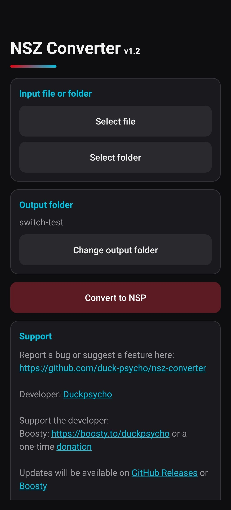

# NSZ Converter

Android application for converting NSZ files to NSP format. Its main purpose is to help NSZ files work in emulators that cannot open them directly.
It supports Android 8.0 and above and only requires access to a single directory to save the resulting NSP file.

If you have any issues or want to suggest a new feature, please create an [issue](https://github.com/duck-psycho/nsz-converter/issues/new).

You can download the latest version of the application in the "[Releases](https://github.com/duck-psycho/nsz-converter/releases)" section.

The project is implemented in Kotlin with no dependencies, only a C++ dependency for Zstandard decompression. That’s why the application file is so lightweight.

## Screenshots

## Support the developer

If you find the app useful, you can support the developer with a donation:

Boosty: https://boosty.to/duckpsycho/donate

BTC (Bitcoin): 178tovsfYQ8omdEPQSHAiH4jXBbBCWNacs

USDT, TRX (TRC20): TLD6QVdHhHNRDgRkYuqhUa2B9bkYgeRxmy

TON: EQDuRyrzSzP8dqbMVNwEBvan_LPK44uRAIuAoT_VF2BXQtS6

ETH (ERC20): 0xF7556e3969e520A677e91E2bFb90EA88bD57EaD9

SOL (Solana): 3tGbXMzqTu7av7DjriY7wkWGEEHxshEZN9SbFP4qBi8v

LTC (Litecoin): LfmZvRPM4zb6EtwnAn9ATLo8kK4Rw7JxUK

BNB: 0xF7556e3969e520A677e91E2bFb90EA88bD57EaD9

## Disclaimer

The author does not support or encourage piracy in any form.

This application does not include, provide, or explain how to obtain `prod.keys`, game dumps, firmware files, or any other copyrighted materials.

The project is intended for developers, research, and compatibility testing only.
Users are solely responsible for ensuring that their use of this software complies with applicable laws and the rights of content owners.

That is precisely why the app is not distributed through Google Play, is not monetized, and does not contain ads.
